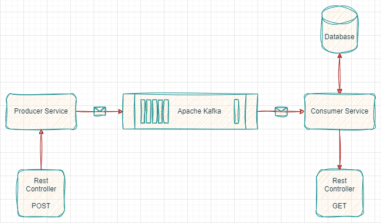

# Система мониторинга с использованием Spring Kafka

## Описание:

<p align="justify">
Система мониторинга, которая отслеживает работу различных компонентов приложения с помощью Spring Kafka. 
Эта система включает в себя Producer для отправки метрик, Consumer для их обработки и анализа, а также REST API для просмотра метрик.
</p>

## Требования:

### Producer Service:

Создать микросервис `Metrics Producer`, который будет отслеживать и собирать
метрики работы приложения и отправлять их в Kafka топик `metrics-topic`.

Реализовать следующие API для взаимодействия с микросервисом: `POST /metrics`.
Отправка метрик работы приложения в формате JSON. Метрики могут
включать информацию о производительности, использовании ресурсов, ошибках и т.
д.

### Consumer Service:

Создать микросервис `Metrics Consumer`, который будет принимать метрики из Kafka
топика `metrics-topic` и анализировать их для выявления проблем и трендов.
Реализовать обработку метрик и вывод статистики в логи или базу данных для
последующего анализа.

Реализовать REST API в микросервисе `Metrics Consumer` для просмотра метрик:<br>
`GET /metrics`: Получение списка всех метрик.<br>
`GET /metrics/{id}`: Получение конкретной метрики по ее идентификатору.

## Технологии/зависимости

В рамках проекта используется:<br>
[](https://adoptium.net/download/)
[](https://spring.io/projects/spring-boot)
[](https://www.h2database.com/html/main.html)
[](https://www.postgresql.org)
[](https://hibernate.org)
[](https://kafka.apache.org)
[](https://maven.apache.org)
[](https://www.docker.com)

### Архитектура



### JDK

Проект написан с использованием JDK (Java) версии 21, который можно скачать,
например, по этой ссылке: https://adoptium.net/download

### Среда разработки

Можно
использовать [JetBrains IntelliJ IDEA](https://www.jetbrains.com/idea/download/)
или [VS Code](https://code.visualstudio.com),
либо любую другую совместимую с вышеуказанными технологиями среду разработки.

### База данных

В качестве БД в проекте по умолчанию используется легкая база
данных [H2](https://www.h2database.com/html/main.html) в режиме совместимости с
БД [PostgreSQL](https://www.postgresql.org). Тем не менее возможен запуск на
основе БД [PostgreSQL](https://www.postgresql.org), читайте далее как это
сделать.

## Основная структура проекта

Приложение разделено на два сервиса: `Producer Service` и `Consumer Service`.
Каждый сервис имеет свой набор классов и интерфейсов.

### Producer Service:

* `ProducerServiceApplication` - точка входа в приложение, запуск приложения
  осуществляется с помощью метода main,
* `config/*` - классы и интерфейсы для настройки окружения,
* `controller/*` - классы для работы REST-сервиса,
* `databind/*` - классы для десериализации структуры JSON,
* `model/*` - классы-сущности предметной области (метрики),
* `publisher/*` - классы-издатели для подготовки данных метрики перед их
  публикацией,
* `sender/*` - классы для непосредственного обмена данными с Apache Kafka,
* `service/*` - классы для взаимодействия с издателями на основе планировщика,
* `utils/*` - вспомогательные классы

#### Конфигурация

- `src/main/resources/application.yaml` - основной файл конфигурации
  приложения<br>
- `src/main/resources/static/open-api.yaml` - спецификация OpenApi

### Consumer Service:

* `ConsumerServiceApplication` - точка входа в приложение, запуск приложения
  осуществляется с помощью метода main,
* `config/*` - классы и интерфейсы для настройки окружения,
* `controller/*` - классы для работы REST-сервиса,
* `databind/*` - классы для сериализации структуры JSON,
* `listener/*` - классы-потребители данных метрики из Apache Kafka,
* `model/*` - классы-сущности предметной области (метрики),
* `repository/*` - классы-репозитории для непосредственного взаимодействия с БД,
* `service/*` - классы для взаимодействия с репозиториями,
* `utils/*` - вспомогательные классы

#### Конфигурация

- `src/main/resources/application.yaml` - основной файл конфигурации
  приложения<br>
- `src/main/resources/static/open-api.yaml` - спецификация OpenApi

#### Структура БД:

```sql
create table metrics
(
    name        varchar(255) not null primary key,
    data        text         not null,
    description varchar(255)
);
```

БД используется только со стороны `Consumer Service`.
Создавать структуру, как правило, нет необходимости, т.к. при первом запуске
приложения структура будет создана благодаря
работе [Hibernate](https://hibernate.org).

В режиме работы с БД H2, есть возможность получить доступ к данным БД из
браузера, используя адрес: http://localhost:8081/h2/

Данные для доступа необходимо взять из основного файла
конфигурации: `src/main/resources/application.yaml`.

> [!IMPORTANT]
> Поменяйте номер порта, если Вы вносили изменения в конфигурацию сервиса.

## Запуск приложения

Скачайте
приложение [архивом](https://github.com/mshamanov/kafka-metrics/archive/refs/heads/master.zip)
или с помощью следующей команды:

```
git clone https://github.com/mshamanov/kafka-metrics.git
```

После того как Вы это сделали, существует несколько вариантов для
непосредственного запуска приложения:

1. Запуск через docker-compose.
2. Запуск каждого сервиса отдельно через среду разработки (IDE).
3. Запуск каждого сервиса отдельно через терминал (консоль).

### Вариант 1 - запуск через docker-compose

В корне приложения находится несколько файлов для docker-compose:

- `docker-compose.yaml` (конфигурация по умолчанию) - подготавливает все сервисы
  для работы приложения совместно с Zookeeper, Apache Kafka и БД H2
- `docker-compose-postgres.yaml` - подготавливает все сервисы для работы
  приложения совместно с Zookeeper, Apache Kafka и БД PostgreSQL
- `docker-compose-kafka.yaml` - подготавливает и запускает только Apache Kafka
  совместно с необходимым для работы инструментом Zookeeper

Для запуска docker-compose Вам понадобится, чтобы он был у Вас уже установлен.
Если Вы этого ещё не сделали, то его можно скачать
с [официального сайта](https://www.docker.com/products/docker-desktop/).

Далее, если используется конфигурация по умолчанию (на основе БД H2) необходимо
запустить следующую команду:

```
docker-compose up -d
```

Если Вы хотите запустить конфигурацию на основе БД PostgreSQL, то необходимо
ввести следующую команду:

```
docker-compose -f docker-compose-postgres.yaml up -d
```

Если Вы хотите установить и запустить только Apache Kafka, выполните следующую
команду (в этом случае остальные сервисы придётся запускать вручную):

```
docker-compose -f docker-compose-kafka.yaml up -d
```

> [!IMPORTANT]
> Важно! Возможно, Вам потребуется внести изменения в файл конфигурации, который
> Вы выбираете для запуска через docker-compose.

Особое внимание следует обратить на параметр `ports`. Если Вы не знакомы с
Docker, Вам нужно знать, что порт указанный слева от двоеточия означает порт
на котором будет работать сервис на Вашем компьютере, справа - это внутренний
порт в контексте Docker, например `29092:29092`. Если у Вас уже есть запущенные
приложения на данных портах, сервисы могут не запуститься. В таком случае,
следует переназначить порты на свободные. За дополнительной информацией
обращайтесь к [официальной документации](https://docs.docker.com/manuals/)
Docker.

Также стоит обратить внимание на следующие параметры:

- `PRODUCER-SERVICE_KAFKA_TOPIC: "metrics-topic"` - название топика для
  сервиса - продьюсера
- `CONSUMER-SERVICE_KAFKA_TOPIC: "metrics-topic"` - название топика для
  сервиса - консьюмера
- `SPRING_KAFKA_BOOTSTRAP_SERVERS: 'kafka:9092'` - адрес брокера Apache Kafka в
  контексте Docker

> [!CAUTION]
> Название топика для продьюсера и консьюмера должны совпадать!

### Вариант 2 - запуск каждого сервиса отдельно через среду разработки

Для запуска приложения Вам понадобится уже запущенная система очередей Apache
Kafka. Далее, Вам необходимо внести изменения в файлы
конфигурации `Producer Service` и `Consumer Service` под Ваше окружение. Файл
конфигурации каждого сервиса находится в `src/main/resources/application.yaml`.

#### Важные параметры:

###### Общие параметры

- `spring.kafka.bootstrap-servers` - адрес Вашего брокера Apache Kafka
- `server.port` - порт на котором будет запущено приложение

###### Параметры Consumer Service

- `spring.datasource.url` - адрес нахождения БД
- `spring.datasource.username` - имя пользователя БД
- `spring.datasource.password` - пароль пользователя БД
- `consumer-service.kafka.topic` - название топика Apache Kafka

###### Параметры Producer Service

- `producer-service.kafka.topic` - название топика Apache Kafka

> [!CAUTION]
> Название топика для продьюсера и консьюмера должны совпадать!

После того как Вы внесли все необходимые изменения в файлы конфигурации под
Ваше окружение, Вы можете запустить приложение из своей среды разработки.

> [!NOTE]
> `Consumer Service` может работать как в режиме встроенной БД H2, так и
> совместно с БД PostgreSQL.

Для переключения режима БД необходимо выбрать соответствующий профиль maven:

- h2 (по умолчанию)
- postgres

Поскольку в каждой среде это делается по-разному и Вы не знаете как именно,
можно открыть файл `pom.xml` в корне `Consumer Service` и **переместить**
параметр `<activeByDefault>true</activeByDefault>` под необходимый профиль.
Только один профиль может быть активным по умолчанию. Например:

```
<profile>
  <id>postgres</id>
  <activation>
    <activeByDefault>true</activeByDefault>
  </activation>
</profile>
```

Также в файл `src/main/resources/application.yaml` потребуется добавить
параметр `spring.profiles.active: postgres`.

После этого можно запустить приложение в режиме работы с БД PostgreSQL.

> [!NOTE]
> Не забудьте внести необходимые изменения в параметры подключения к БД (см.
> выше).

### Вариант 3 - запуск каждого сервиса отдельно через терминал (консоль)

Для запуска приложения Вам необходимо проделать почти все шаги по настройке,
указанные во втором варианте запуска. Однако, вместо запуска приложения
непосредственно из среды разработки, Вы можете воспользоваться командами maven
из Вашего терминала (консоли), в том числе для установки профиля
maven для совместной работы `Consumer Service` с БД PostgreSQL.

В том случае, если maven у Вас уже установлен, Вы можете запустить следующую
команду:

```
mvn spring-boot:run
```

Если Maven не установлен на Вашем компьютере, то Вы можете запустить следующую
команду:

```
./mvnw spring-boot:run
```

Данные команды необходимо проделать для каждого сервиса: `Producer Service`
и `Consumer Service`, предварительно установив их в качестве рабочего каталога в
Вашем терминале.

Для `Consumer Service` есть возможность установить профиль maven для смены
режима БД:

- для работы с БД H2:

```
mvn spring-boot:run -Dactive.spring.profiles=h2
```

- для работы с БД PostgreSQL

```
mvn spring-boot:run -Dactive.spring.profiles=postgres
```

При этом добавлять в файл `src/main/resources/application.yaml`
параметр `spring.profiles.active` нет необходимости, он автоматически
подставится.

> [!NOTE]
> Не забудьте внести необходимые изменения в параметры подключения к БД (см.
> выше).
---

При успешном запуске приложения сервис `Producer Service` будет отправлять
данные метрики, полученные из модуля `Spring Boot Actuator`, через систему
обмена сообщений Apache Kafka с установленной периодичностью. По умолчанию этот
параметр равен 30 секундам (см. `Producer Service`, каталог `service/*`).
Сервис `Consumer Service` будет получать эти данные и сохранять в БД актуальные
данные. У каждого из сервисов есть свой REST API. Можно отправить любые
необходимые данные метрики, используя метод `POST` через доступный REST
сервис `Producer Service`. Соответственно, можно получить актуальные данные
метрики, используя метод `GET` через доступный REST сервис `Consumer Service`.
Для каждого сервиса во время своей работы доступна пользовательская среда
Swagger-UI в браузере для непосредственного взаимодействия с REST API:

- `Producer Service` - [http://localhost:8080/swagger-ui.html](http://localhost:8080/swagger-ui.html)
- `Consumer Service` - [http://localhost:8081/swagger-ui.html](http://localhost:8080/swagger-ui.html)

> [!IMPORTANT]
> Поменяйте номер порта, если Вы вносили изменения в конфигурацию сервисов.

Для взаимодействия с REST API Вы также можете воспользоваться таким инструментом
как, например, [Postman](https://www.postman.com). Для каждого сервиса в
файле `src/main/resources/static/open-api.yaml` находится спецификация OpenApi.

---

Таким образом, сервисы успешно обмениваются данными через Apache Kafka и
обеспечивают сбор и анализ метрик работы приложения.
Система масштабируема, надежна и обладает высокой производительностью.

## Лицензия

[](https://opensource.org/licenses/MIT)